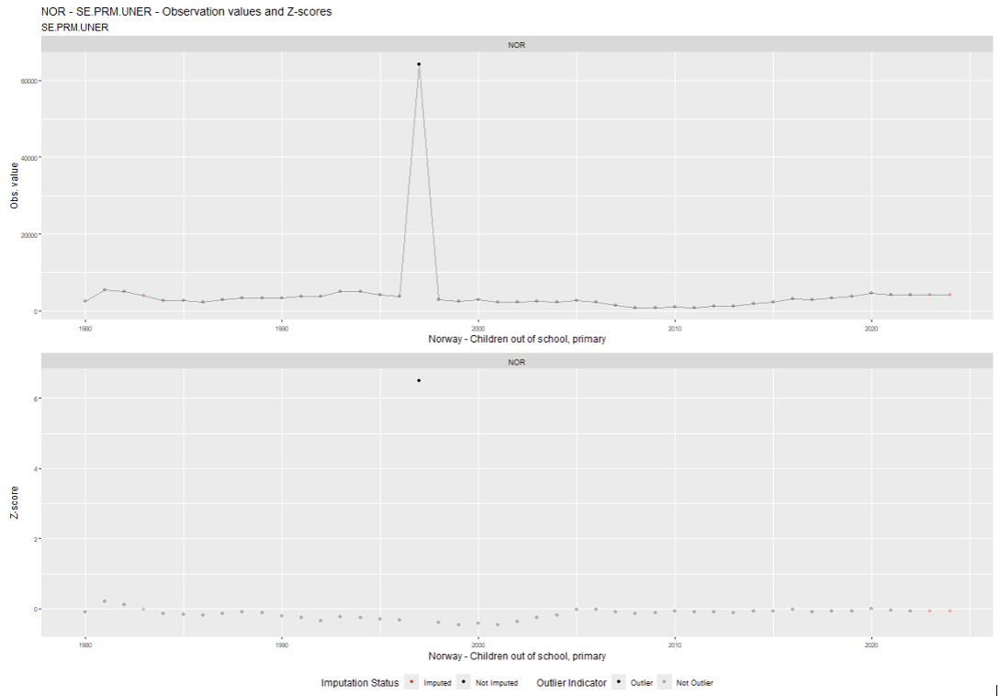

<!-- README.md is generated from README.Rmd. Please edit that file -->

```{r, include = FALSE}
knitr::opts_chunk$set(
  collapse = TRUE,
  comment = "#>",
  fig.path = "man/figures/README-",
  out.width = "100%"
)
```

# macroanomaly

<!-- badges: start -->
[](https://github.com/worldbank/macroanomaly/actions/workflows/R-CMD-check.yaml)
<!-- badges: end -->

`macroanomaly` is an R package for detecting anomalies in social and economic time series data. It was designed to support the kind of indicator-based work common in international development contexts, where data quality issues — outliers, errors, and missing values — can meaningfully affect analysis and policy conclusions.

## Overview
Social and economic time series present a distinctive set of challenges: short observation histories (sometimes only a few dozen data points), missing values, and the presence of seasonal patterns or long-term trends. `macroanomaly` is built specifically to address these characteristics.

The package implements a streamlined three-step workflow:

1.	**Prepare** — Missing values are imputed in a statistically neutral manner, and the series is transformed to achieve stationarity by removing trend and seasonal components.
2.	**Detect** — A selection of statistical and machine learning methods is applied to identify potential anomalies.
3.	**Report** — Results are exported to a CSV file with anomaly flags and per-method detection metrics, alongside diagnostic plots to support visual interpretation.

## Input and Output
The package accepts data in long format as its primary input. Its main outputs are:

*	A CSV file flagging potential anomalies, with metrics provided for each detection method applied.
*	Plots for visual exploration and validation of results.

## Installation

You can install the development version of `macroanomaly` from [GitHub](https://github.com/) with:

``` rH
# install.packages("devtools")
devtools::install_github("worldbank/macroanomaly", dependencies = TRUE, build_vignettes = TRUE)
```

## Workflow

The package follows a simple three-step pipeline:

1.	**normalize()** - Prepare time series data (detrend, impute, normalize)
2.	**detect()** - Identify anomalies using one or multiple detection methods. We can detect anomalies using multiple methods simultaneously.
3.	**report()** – Use plot or summary commands


## Example

This example utilises education-related indicators from the World Bank Development Indicators (WDI) dataset to illustrate a comprehensive workflow encompassing data preparation, normalisation, anomaly detection, and reporting.

For detailed examples and explanations of all methods, see the `vignette("Macroanomaly")`.

```{r example}

# Anomaly detection in WDI data set - Standard Education (SE) indicators

library(macroanomaly)
library(collapse)
library(tidyr)
library(dplyr)

# Set a default folder, download/unzip/read the WDI data set, subset education
setwd(tempdir())
wdi_url <- "https://databank.worldbank.org/data/download/WDI_CSV.zip"
download.file(wdi_url, destfile = "WDI_CSV.zip")
unzip("WDI_CSV.zip")
df_wdi <- read.csv("WDICSV.csv")
df_wdi_SE <- df_wdi[startsWith(df_wdi$Indicator.Code, "SE."), ]

# Prepare the data: reshape from wide to long, drop years < 1980 and series with 
# insufficient number of non-missing values
df_wdi_SE <- df_wdi_SE %>%
  pivot_longer(cols = starts_with("X"), 
               names_to = "Year", values_to = "Value") %>%
  mutate(Year = as.integer(sub("X", "", Year))) 
df_wdi_SE <- df_wdi_SE[df_wdi_SE$Year >= 1980, ]
df_wdi_SE <- df_wdi_SE %>%
  group_by(Country.Code, Indicator.Code) %>%
  filter(sum(!is.na(Value)) >= 10) %>%
  ungroup()

# Normalize the data set (de-trend and impute missing values)
df_wdi_SE |>
  normalize(.value_col= "Value",
            .country_col = c("Country.Code", "Country.Name"),
            .indicator_col = "Indicator.Code",
            .time_col = "Year",
            .detrend = TRUE, 
            .impute = TRUE) -> wdi_SE_normalized

# Detect anomalies (6 methods), sort by severity, and save output as CSV.
wdi_SE_normalized |>
  detect(.method = c("tsoutlier", "isotree", "capa", "outliertree", "zscore",
                     "hampel"), 
         .args = list(capa = c(.min_seg_len=3), 
                      isotree = c(.threshold=0.7),
                      hampel = c(.trim = TRUE, .trim_sd = 1.5)
                      ),
         .additional_cols = TRUE) -> wdi_SE_anomalies
wdi_SE_anomalies <- wdi_SE_anomalies[
  order(-wdi_SE_anomalies$outlier_indicator_total,
        -wdi_SE_anomalies$absZscore_zscore), ]
write.csv(wdi_SE_anomalies, file = "WDI_SE_ANOMALIES.CSV", row.names = FALSE)

# Show number of anomalies detected, and observations by number of methods 
# having flagged an observation as an anomaly
summary(wdi_SE_anomalies)
table(wdi_SE_anomalies$outlier_indicator_total)

# Plot a sample of 20 anomalies 
for(i in 1:20) {
  if(wdi_SE_anomalies$Imputed[i] == FALSE) {
    subttl <- paste0(wdi_SE_anomalies$Country.Name[i], " - ", 
                     wdi_SE_anomalies$Indicator.Name[i])
    print(plot(wdi_SE_anomalies, 
               country = wdi_SE_anomalies$Country.Code[i], 
               indicator = wdi_SE_anomalies$Indicator.Code[i],
               .total_threshold = 2, x.lab = subttl))
  }
}


```

The script will generate a CSV file and 20 plots like the one below:



